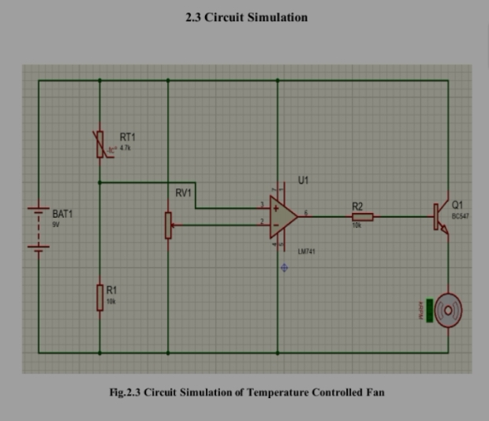
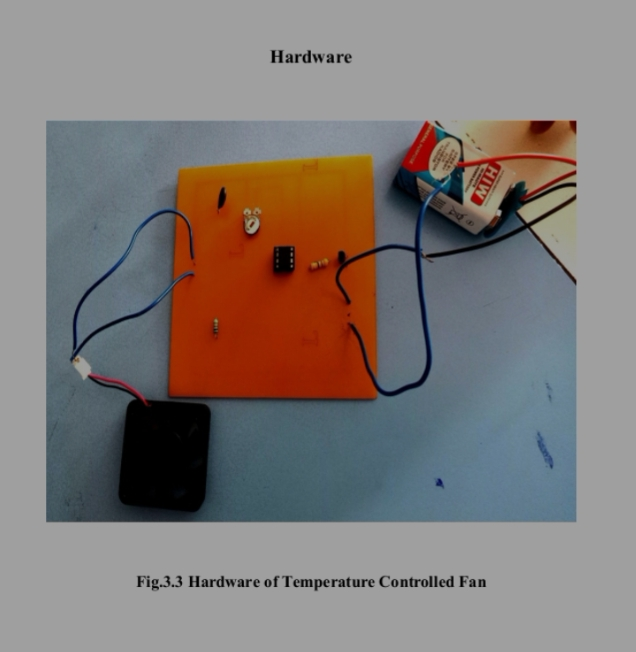

# Temperature-controlled-fan-by-using-LM-35-ic-
Automatic fan speed control system using operational amplifier LM741 and thermister. Fan turns ON/OFF based on temperature.
## Circuit Diagram

## Hardware Setup

